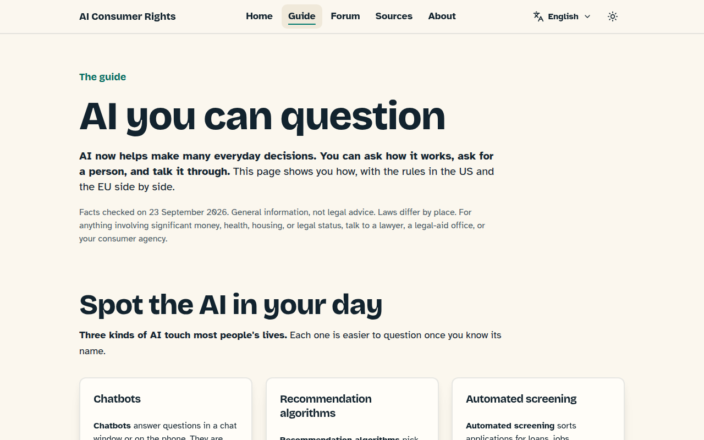
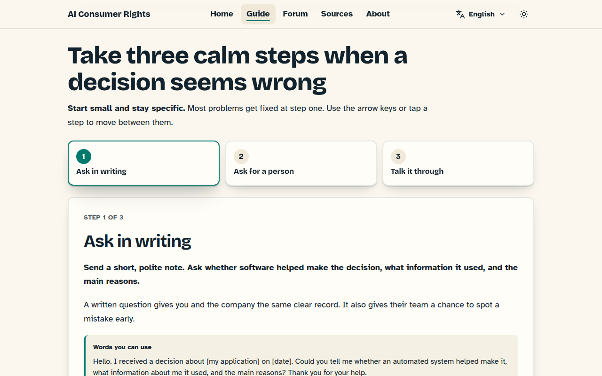
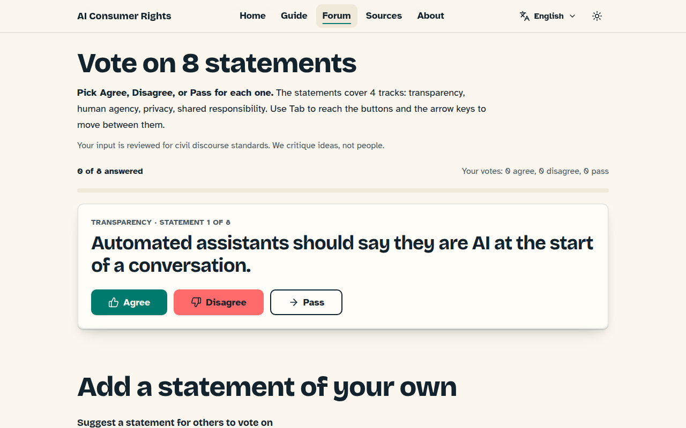
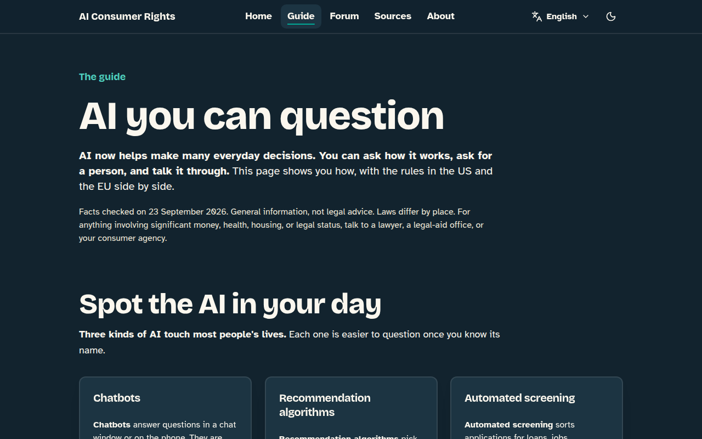
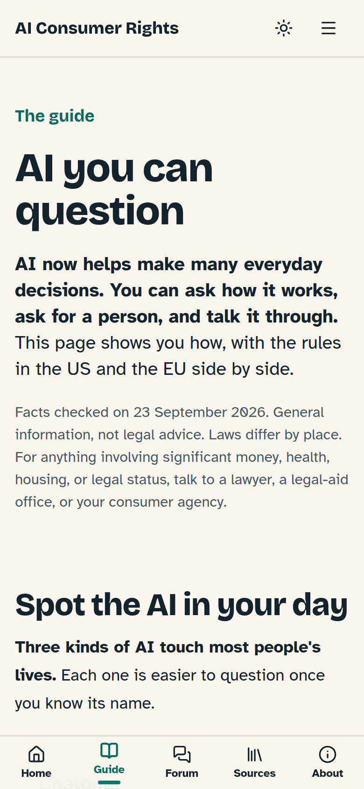
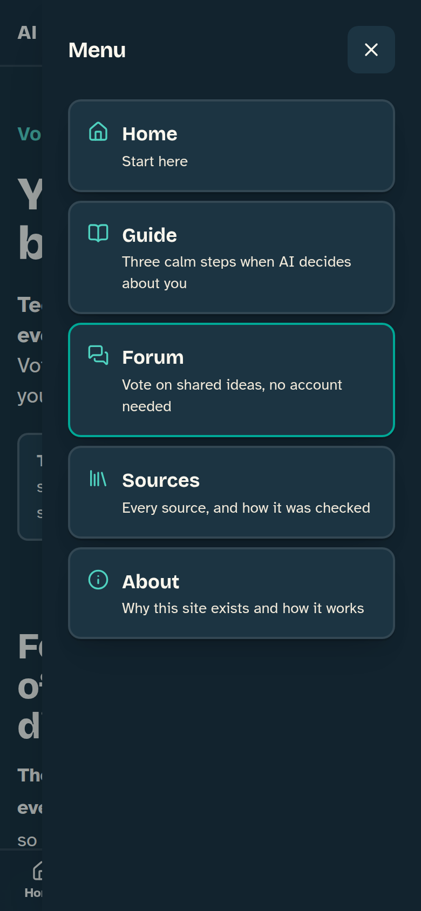

# 🤝 AI Consumer Rights

**Plain-language help with your rights when AI makes decisions about you, built through open, respectful dialogue.**

🌐 **Live preview:** [aiconsumerrights-org-chi.vercel.app](https://aiconsumerrights-org-chi.vercel.app) · 🗣️ English, Español, Português (PT), Português (BR), and Italiano · 📜 [MIT License](LICENSE) · ♿ Tested against WCAG 2.2 AA



---

## 🎯 Mission

This project makes AI consumer rights easy to understand and easy to talk about. It brings together US and EU perspectives, and invites everyone into the conversation: people who use AI, educators, regulators, and the teams that build it.

### 💛 Blameless and non-generalizing, always

- 🚫 **No singling out.** No page, prompt, or line of UI copy shames or generalizes any company, platform, or person.
- 🧑‍🤝‍🧑 **Everyone is a stakeholder.** The site starts from the view that people in every sector act in good faith and do their best with what they know.
- 💡 **Critique ideas and systems, never people.** Challenges are framed around clarity, plain language, and mutual benefit.

## 🛡️ The five civic safeguards

| | Safeguard | How the site does it |
|---|---|---|
| 🔁 | **Traceability** | Every forum question leads to a visible outcome, recorded in a "We asked, you said, we did" card. |
| 🤖 | **Bot and spam resistance** | Voting uses single, stand-alone statements (Agree, Disagree, Pass). There are no reply threads. |
| ♿ | **Zero-barrier access** | No account needed to vote. Pages aim for a grade 6 to 8 reading level and are tested against WCAG 2.2 AA. |
| 🌉 | **Common ground first** | Results show a statement only when every opinion group agrees. |
| ⚡ | **Sturdy by design** | Static pages, kept separate from interactive features, so the content loads fast and keeps working. |

## ✨ What's inside

### 📖 The guide: "AI you can question"

- 🔍 **Spot the AI in your day:** chatbots, recommendation algorithms, and automated screening, in plain words.
- ⚖️ **US, EU, Brazil, and Italy rules, side by side:** each claim is labeled (Law, Guidance, Research) and linked to a numbered source.
- 🪜 **Algorithm Decision Explorer:** three calm steps (ask in writing, ask for a person, talk it through), with sample wording you can copy.



### 🗳️ The forum: "Your voice belongs here"

- 🃏 Pol.is-style voting on 8 statements across 4 tracks: transparency, human agency, privacy, and shared responsibility.
- ✍️ A 140-character box to suggest your own statement, with a clear pre-moderation notice.
- 📊 A consensus view that highlights agreement across groups.



> 🧪 **The forum is in preview.** Votes and statements stay in your browser, and nothing is sent anywhere yet. The consensus card shows clearly labeled example data until real votes exist.

### 🔎 Provenance on every page

Every page ends with a **"How this site was made"** footer that lists:

- 🤖 **The AI models that helped:** only those with a record of their work (GPT, Claude, Gemini, and unrecorded OpenRouter models).
- 📚 **The primary sources:** UNESCO, Pew Research, the Stanford AI Index, W3C WCAG 2.2, the FTC, the CFPB, and the EU AI Act.
- 🧑‍⚖️ **Human review status:** the footer says plainly when review is still pending.

The full registry lives at [`/sources`](https://aiconsumerrights-org-chi.vercel.app/sources) and in [`lib/data/sources.json`](lib/data/sources.json). Each entry records whether its link was opened and checked.

### 🗣️ English, Spanish, Portuguese (Portugal and Brazil), and Italian

- 🌎 Every page exists at `/en/...`, `/es/...`, `/pt/...` (Portugal), `/pt-BR/...` (Brazil), and `/it/...` (Italy). A visit to `/` opens the language your browser asks for.
- 🔁 The language menu in the header, or in the mobile menu, keeps you on the same page: `/en/forum` becomes `/es/forum`.
- 📝 Spanish, European Portuguese, Brazilian Portuguese, and Italian text is written at a grade 6 to 8 reading level and keeps the same warm, blameless tone. Every key, placeholder, and citation matches the English, and tests fail if any key is missing.
- ⏸️ The PAUSE Strategy spells PAUSE in English and PAUSA in Spanish, Portuguese, and Italian.
- 🔎 Search engines get `hreflang` links between the versions, in the page head and in the sitemap.

### 🌗 Light and dark, desktop and mobile

| Dark mode | Mobile | Mobile menu |
|---|---|---|
|  |  |  |

## 🎨 Design system

- 🍦 **Palette:** warm cream `#FBF7EE`, charcoal `#12232E`, teal `#00A896`, and coral `#FF6B6B`. Every text and focus color is contrast-tested in both themes.
- 🔠 **Type:** Bricolage Grotesque for bold, scannable "layer-cake" headings, and Atkinson Hyperlegible for body text.
- 👆 **Touch targets:** 24×24px with a mouse and 44×44px on touch screens (SC 2.5.8).
- 🎯 **Focus rings:** 3px, with at least 3:1 contrast in light and dark (SC 2.4.13).
- 🧊 **Depth and motion:** CSS-only 3D depth cards and small micro-interactions. All of it turns off when the visitor asks for less motion.

## 🧰 Tech stack

Next.js 14 (App Router) · next-intl · TypeScript · Tailwind CSS · shadcn/ui · Radix UI · next-themes · Jest + React Testing Library · jest-axe · axe-core + Puppeteer

## 🚀 Getting started

```bash
npm install
npm run dev          # http://localhost:3000 (opens /en or /es)
```

| Command | What it does |
|---|---|
| `npm test` | Runs the Jest and React Testing Library suite, including axe checks on every page |
| `npx tsc --noEmit` | Type-checks the project |
| `npm run lint` | Runs Next.js lint |
| `npm run build` | Makes the production build |
| `npm run audit:a11y` | Runs a real-browser WCAG 2.2 A/AA audit of the production build, on every route in all five languages, in light and dark, on desktop and mobile |
| `npm run screenshots` | Regenerates the images in `docs/screenshots` |

> 💡 `audit:a11y` and `screenshots` need a Chromium browser. Set `CHROME_PATH` if yours is not at Playwright's default location.

## 🗂️ Project layout

```
app/[locale]/         Pages: /, /guide, /forum, /sources, /about, in /en, /es, /pt, /pt-BR, and /it
app/                  Sitemap, robots, and the share image
messages/             en.json, es.json, pt-PT.json, pt-BR.json, and it.json, every string on the site
i18n.ts, middleware.ts  Loads messages per request; adds the locale and detects the browser language
components/ui/        Design-system primitives: Button, Card, ThemeToggle, LanguageSwitcher, SiteNav, AttributionFooter
components/guide/     AlgorithmExplorer
components/forum/     VotingEngine, StatementSubmission, ConsensusCluster
lib/                  Site config, SEO helpers, source registry, forum statements
lib/data/sources.json The transparency registry every citation resolves to
scripts/              Real-browser accessibility audit and screenshot tools
__tests__/            272 unit, integration, accessibility, i18n, and SEO tests
```

## ✅ Quality bar

Every phase ships only when all of these pass:

- 🧪 **Jest:** 272 tests, including axe on every page in all five languages, matching keys across message files, and tone checks that fail on blame words, "we" on the guide, or named companies.
- 🔤 **TypeScript and lint:** zero errors, zero warnings.
- 🏗️ **Production build:** zero warnings.
- ♿ **Real-browser audit:** zero WCAG A/AA violations across 102 page states in all five languages, with a built-in canary that proves the checks work.

## 🤖 AI assistance disclosure

This project was researched and drafted with help from AI models. The code and page text were written with **Claude (Anthropic)** in Claude Code. Research drafts also came from **GPT (OpenAI)** and **Gemini (Google)**, plus other models through OpenRouter whose names the chat exports do not record. A person reviews every page before launch, and the site's footer shows where that review stands.

## 🌱 Contributing

Ideas and fixes are welcome. Please follow the same principles the forum uses:

1. 💬 Critique ideas, never people.
2. 🤲 Assume good faith.
3. ✨ Pair positivity with substance.
4. 🔍 Be open about AI use, cite your sources, and say what you don't know.
5. 🪜 Lift while you climb.

Every change needs passing tests, a clean build, and a clean `npm run audit:a11y` run.

## 📜 License

[MIT](LICENSE) © 2026 Robert Sweetman
