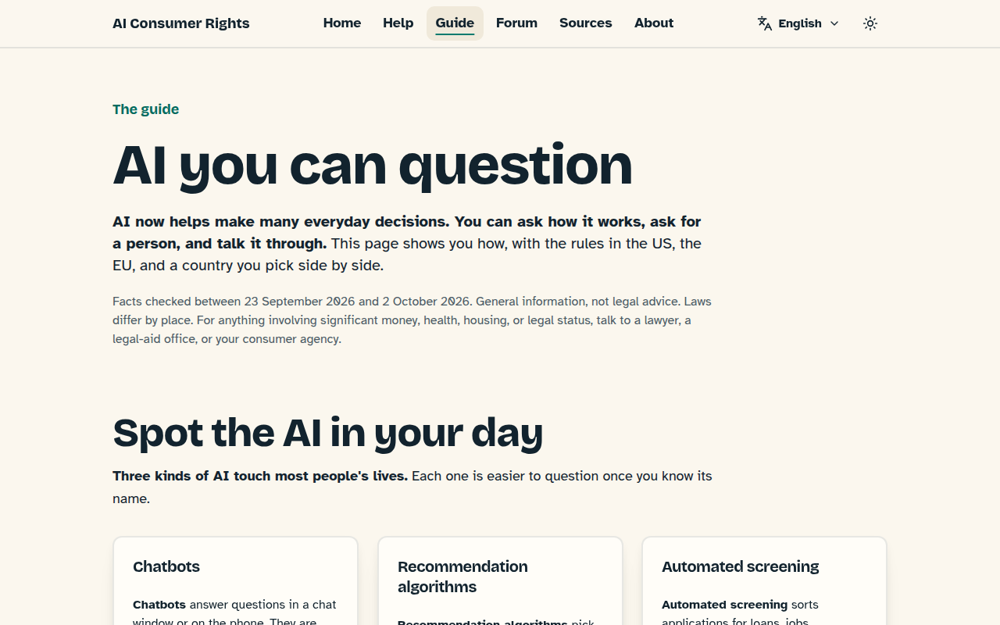
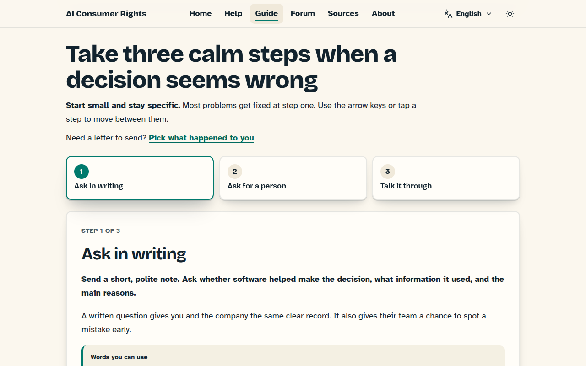
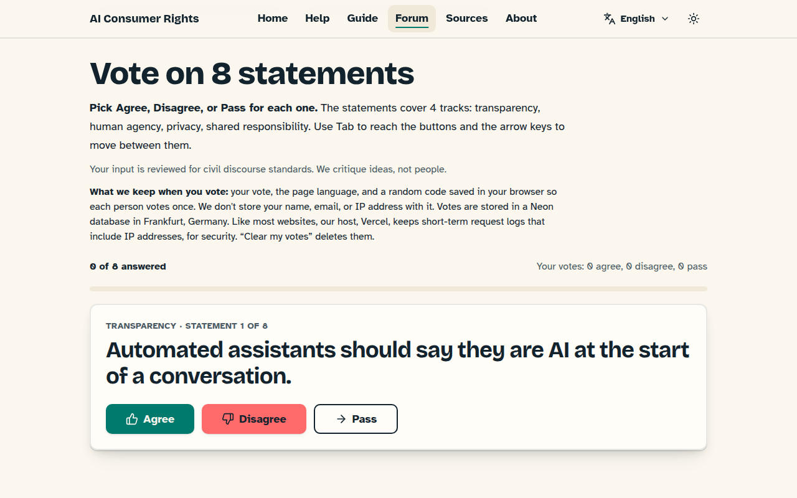
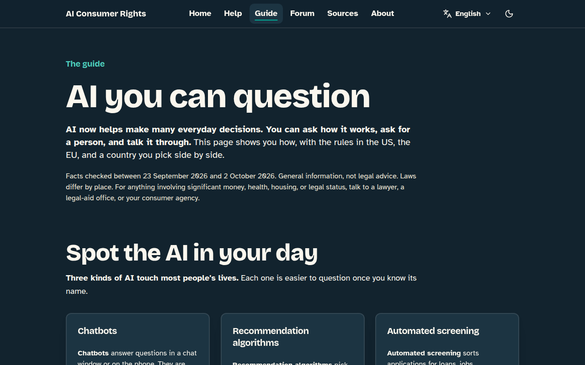
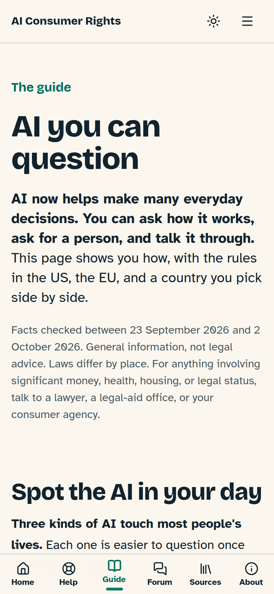
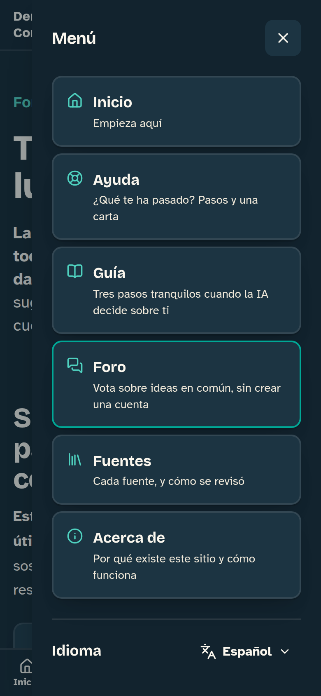

# 🤝 AI Consumer Rights

**Plain-language help with your rights when AI makes decisions about you, built through open, respectful dialogue.**

🌐 **Live:** [aiconsumerrights.org](https://aiconsumerrights.org) · 🗣️ English, Español, Português (PT), Português (BR), Italiano, Français, Deutsch, and हिन्दी · 📜 Code: [MIT](LICENSE) · Writing: [CC BY 4.0](LICENSE-CONTENT) · ♿ Tested against WCAG 2.2 AA



---

## 🎯 Mission

This project makes AI consumer rights easy to understand and easy to talk about. It brings together perspectives from the US, the UK, the EU, Brazil, India, and beyond, and invites everyone into the conversation: people who use AI, educators, regulators, and the teams that build it.

### 💛 Blameless and non-generalizing, always

- 🚫 **No singling out.** No page, prompt, or line of UI copy shames or generalizes any company, platform, or person.
- 🧑‍🤝‍🧑 **Everyone is a stakeholder.** The site starts from the view that people in every sector act in good faith and do their best with what they know.
- 💡 **Critique ideas and systems, never people.** Challenges are framed around clarity, plain language, and mutual benefit.

## 🛡️ The five civic safeguards

| | Safeguard | How the site does it |
|---|---|---|
| 🔁 | **Traceability** | The forum's "We asked, you said, we did" card records what changed because of votes. It stays empty until there is a real outcome to show. Fixed mistakes are listed in a public corrections log. |
| 🤖 | **Bot and spam resistance** | Voting uses single, stand-alone statements (Agree, Disagree, Pass). There are no reply threads, and a person reads every suggestion before it is shown. Voting needs no account, so repeat votes can't be fully prevented; a speed limit per connection slows scripts down, and the site says plainly that results are a rough signal. |
| ♿ | **Zero-barrier access** | No account needed to vote. Pages aim for a grade 6 to 8 reading level and are tested against WCAG 2.2 AA. |
| 🌉 | **Common ground first** | Votes are grouped by the language people vote in, and a statement counts as broad agreement only when every language group supports it. |
| ⚡ | **Sturdy by design** | Static pages, kept separate from interactive features, so the content loads fast and keeps working. |

## ✨ What's inside

### 🆘 Help: "What happened to you?"

- 🧭 **Situation guides:** a refused loan or credit, a job application screened out, a rental application turned down, an insurance decision, a chatbot or refund problem, a blocked account or removed post, and a fake voice or video used to trick someone (with urgent first steps).
- 🌍 **Rights where you live:** the US, the UK, the EU, Brazil, India, or somewhere else, with every right linked to a numbered source.
- ✉️ **A letter you fill in:** copy it, print it, or open it in your own email app. Nothing you type leaves your device.
- 🤝 **A note for the company that gets the letter,** on how to answer well. Nobody is blamed.
- 🚧 **Shortcomings stated up front:** no lawyer, legal clinic, or consumer organisation has reviewed the pages yet, and native speakers haven't checked the translations. Reviewers can write to reviewers@aiconsumerrights.org.

### 📖 The guide: "AI you can question"

- 🔍 **Spot the AI in your day:** chatbots, recommendation algorithms, and automated screening, in plain words.
- ⚖️ **US and EU rules, side by side with one more country you pick (Brazil, France, Germany, India, or Italy):** each claim is labeled (Law, Guidance, Research) and linked to a numbered source.
- 🪜 **Algorithm Decision Explorer:** three calm steps (ask in writing, ask for a person, talk it through), with sample wording you can copy.



### 🗳️ The forum: "Your voice belongs here"

- 🃏 Pol.is-style voting on 8 statements across 4 tracks: transparency, human agency, privacy, and shared responsibility.
- ✍️ A 140-character box to suggest your own statement, with a clear pre-moderation notice.
- 📊 A consensus view that highlights agreement across groups.



> 🗳️ **How the forum works:** votes are counted in a database in Frankfurt, Germany, stored with a scrambled browser code and no name, email, or IP address. Suggested statements get an automated first check and then wait for a person to review them. The [How this site works](https://aiconsumerrights.org/en/how-it-works) page lists every service, what each one sees, and what isn't finished.

### 🔎 Provenance on every page

Every page ends with a **"How this site was made"** footer that lists:

- 🤖 **The AI models that helped:** only those with a record of their work (GPT, Claude, Gemini, and unrecorded OpenRouter models).
- 📚 **The primary sources:** the laws and official pages the facts rest on, from the EU AI Act and the GDPR to national laws in the US, UK, Brazil, India, Italy, France, and Germany, plus UNESCO, Pew Research, the Stanford AI Index, and W3C WCAG 2.2.
- 🧑‍⚖️ **Human review status:** the footer says plainly when review is still pending.

The full registry lives at [`/sources`](https://aiconsumerrights.org/en/sources) and in [`lib/data/sources.json`](lib/data/sources.json). Each entry records whether its link was opened and checked.

#### 🔐 Check a source yourself

- **`status: "confirmed"`** means an AI (Claude, or research agents it directed) opened the link and the content matched. It does **not** mean a person read it.
- **`readBy`** is the day Robert read the source himself.
- **`archived`** is a snapshot at the [Internet Archive](https://web.archive.org). A third party timestamps it and nobody here can change it, so you can see the page as it was when checked, even if the original later moves or changes.
- **`copies`** holds the SHA-256 fingerprint of each copy Robert saved. The copies themselves are not published, because the work belongs to its authors.
  - `"original"` means the publisher's own file. Download it from the source link and check that it matches, e.g. `sha256sum file.pdf`.
  - `"print"` means Robert's browser saved the web page as a PDF. Only his copy will match that fingerprint, and he can share it on request.

### 🗣️ English, Spanish, Portuguese (Portugal and Brazil), Italian, French, German, and Hindi

- 🌎 Every page exists at `/en/...`, `/es/...`, `/pt/...` (Portugal), `/pt-BR/...` (Brazil), `/it/...`, `/fr/...`, `/de/...`, and `/hi/...`. A visit to `/` opens the language your browser asks for.
- 🔁 The language menu in the header, or in the mobile menu, keeps you on the same page: `/en/forum` becomes `/es/forum`.
- 📝 Spanish, European Portuguese, Brazilian Portuguese, Italian, French, German, and Hindi text is written at a grade 6 to 8 reading level and keeps the same warm, blameless tone. Every key, placeholder, and citation matches the English, and tests fail if any key is missing.
- ⏸️ The PAUSE Strategy spells PAUSE in English, French, and German, and PAUSA in Spanish, Portuguese, and Italian. Hindi keeps PAUSE and pairs each English keyword with its Hindi meaning, since Devanagari cannot spell it.
- 🔎 Search engines get `hreflang` links between the versions, in the page head and in the sitemap.

### 🌗 Light and dark, desktop and mobile

| Dark mode | Mobile | Mobile menu |
|---|---|---|
|  |  |  |

## 🎨 Design system

- 🍦 **Palette:** warm cream `#FBF7EE`, charcoal `#12232E`, teal `#00A896`, and coral `#FF6B6B`. Every text and focus color is contrast-tested in both themes.
- 🔠 **Type:** Bricolage Grotesque for bold, scannable "layer-cake" headings, and Atkinson Hyperlegible for body text.
- 👆 **Touch targets:** 24×24px with a mouse and 44×44px on touch screens (SC 2.5.8).
- 🎯 **Focus rings:** 3px, with at least 3:1 contrast in light and dark (SC 2.4.13).
- 🧊 **Depth and motion:** CSS-only 3D depth cards and small micro-interactions. All of it turns off when the visitor asks for less motion.

## 🧰 Tech stack

Next.js 16 (App Router) · next-intl · TypeScript · Tailwind CSS · shadcn/ui · Radix UI · next-themes · Neon Postgres (forum votes and suggestions) · Jest + React Testing Library · jest-axe · axe-core + Puppeteer

## 🚀 Getting started

Use Node.js 24 (see `.nvmrc`).

```bash
npm install
npm run dev          # http://localhost:3000 (opens the language your browser asks for)
```

The pages work with no setup. The forum's votes, suggestions, and review page need these in `.env.local`:

| Variable | What it is for |
|---|---|
| `DATABASE_URL` | A Postgres database for votes and suggestions. Run `npm run db:migrate` once to create the tables. |
| `OPENROUTER_API_KEY` | The AI check that looks for names and contact details in a suggestion. Without it, suggestions are marked "not checked". |
| `FORUM_ADMIN_PASSWORD` | The password for the review page at `/admin`, 12 characters or more. |
| `NEXT_PUBLIC_SITE_URL` | The site's address, if it is not `https://aiconsumerrights.org`. |

| Command | What it does |
|---|---|
| `npm test` | Runs the Jest and React Testing Library suite, including axe checks on every page |
| `npx tsc --noEmit` | Type-checks the project |
| `npm run lint` | Runs ESLint |
| `npm run build` | Makes the production build |
| `npm run audit:a11y` | Runs a real-browser WCAG 2.2 A/AA audit of the production build, on every route in all eight languages, in light and dark, on desktop and mobile |
| `npm run screenshots` | Regenerates the images in `docs/screenshots` |
| `npm run db:migrate` | Creates the forum tables from `db/schema.sql` |

> 💡 `audit:a11y` and `screenshots` need a Chromium browser. Set `CHROME_PATH` to its location.

## 🗂️ Project layout

```
app/[locale]/         Pages: /, /help, /help/[situation], /guide, /forum, /sources, /about, /how-it-works, in all eight languages
app/                  Sitemap, robots, and the share image
messages/             en, es, pt-PT, pt-BR, it, fr, de, and hi: every string on the site
i18n.ts, proxy.ts       Loads messages per request; adds the locale and detects the browser language
components/ui/        Design-system primitives: Button, Card, ThemeToggle, LanguageSwitcher, SiteNav, AttributionFooter
components/guide/     AlgorithmExplorer, CompareTable, PAUSEStrategy
components/help/      RegionPicker, LetterBuilder
components/forum/     VotingEngine, StatementSubmission, ConsensusCluster
lib/                  Site config, SEO helpers, source registry, help situations, forum database and statements
lib/data/sources.json The transparency registry every citation resolves to
content/              The public logs, written by hand: corrections and "We did"
scripts/              Real-browser accessibility audit, screenshot, and database setup tools
__tests__/            Unit, integration, accessibility, i18n, and SEO tests
```

## ✅ Quality bar

Every phase ships only when all of these pass:

- 🧪 **Jest:** more than 500 tests, including axe on every page in all eight languages, matching keys across message files, and tone checks that fail on blame words, "we" on the guide, or named companies.
- 🔤 **TypeScript and lint:** zero errors, zero warnings.
- 🏗️ **Production build:** zero warnings.
- ♿ **Real-browser audit:** zero WCAG A/AA violations on every route in all eight languages, in both themes and on desktop and touch screens, with a built-in canary that proves the checks work.

## 🤖 AI assistance disclosure

This project was researched and drafted with help from AI models. The code and page text were written with **Claude (Anthropic)** in Claude Code. Research drafts also came from **GPT (OpenAI)** and **Gemini (Google)**, plus other models through OpenRouter whose names the chat exports do not record. Robert is still checking the pages against their sources, and no lawyer, legal clinic, or consumer organisation has reviewed them yet. Every page says so, and the footer shows where review stands.

## 🌱 Contributing

Ideas and fixes are welcome. Please follow the same principles the forum uses:

1. 💬 Critique ideas, never people.
2. 🤲 Assume good faith.
3. ✨ Pair positivity with substance.
4. 🔍 Be open about AI use, cite your sources, and say what you don't know.
5. 🪜 Lift while you climb.

Every change needs passing tests, a clean build, and a clean `npm run audit:a11y` run. Criticism with a reason is welcome at feedback@aiconsumerrights.org. See [CONTRIBUTING](.github/CONTRIBUTING.md), the [code of conduct](.github/CODE_OF_CONDUCT.md), and how to [report a security problem](.github/SECURITY.md).

## 📜 License

[MIT](LICENSE) © 2026 Robert Sweetman

The site's writing (the text in `messages/` and `content/`) is [CC BY 4.0](LICENSE-CONTENT): reuse it with credit.
